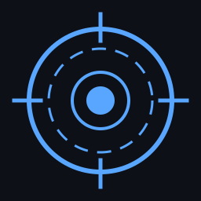

<div align="center">



# J.A.R.V.I.S - Desktop AI Assistant

[](https://github.com/mkr-infinity/jarvis/stargazers)
[](https://github.com/mkr-infinity/jarvis/network/members)
[](https://github.com/mkr-infinity/jarvis/issues)
[](https://github.com/mkr-infinity/jarvis/blob/main/LICENSE)
[](https://python.org)
[](https://nodejs.org)
[](https://www.electronjs.org)

> **Your personal AI assistant, inspired by Iron Man's J.A.R.V.I.S.**

</div>

---

## Overview

J.A.R.V.I.S is a lightweight, cross-platform desktop AI assistant with voice capabilities, featuring a stunning Iron Man-inspired arc reactor interface. Built with Electron, FastAPI, and vanilla JavaScript - no heavy frameworks, just pure performance.

## Features

| Feature | Description |
|---------|-------------|
| Arc Reactor UI | Stunning HUD interface with animated power orb |
| Voice Mode | Click the mic for voice input with green reactor animation |
| Multi-AI Support | Ollama (local), OpenAI, Anthropic, Gemini, Groq |
| Text-to-Speech | JARVIS speaks responses aloud |
| Chat History | Organized projects and conversation sessions |
| API Key Management | Persistent settings saved to database |
| Keyboard Shortcuts | Enter to send, ESC to close panels |
| System Commands | Search, open URLs, screenshots, volume control |
| Dark Theme | Iron Man JARVIS style with arc reactor colors |

## Screenshots

<div align="center">
  <em>Screenshots coming soon</em>
</div>

## Requirements

| Dependency | Version | Purpose |
|------------|---------|---------|
| Python | 3.10+ | Backend API server |
| Node.js | 18+ | Electron desktop app |
| Ollama | Latest | Local AI models (optional) |
| npm | 9+ | Package management |

## Installation

### 1. Clone the Repository

```bash
git clone https://github.com/mkr-infinity/jarvis.git
cd jarvis
```

### 2. Install Dependencies

**Linux/macOS:**
```bash
# Python backend dependencies
pip install -r requirements.txt

# Electron frontend dependencies
npm install
```

**Windows:**
```cmd
:: Python backend dependencies
pip install -r requirements.txt

:: Electron frontend dependencies
npm install
```

## Running the App

### Option 1: One-Command Start (Recommended)

**Linux/macOS:**
```bash
bash scripts/run.sh
```

**Windows:**
```cmd
scripts\run.bat
```

### Option 2: Manual Terminal Start

Open **two terminals**:

**Terminal 1 - Backend:**
```bash
npm run backend
```

**Terminal 2 - GUI:**
```bash
npm start
```

### Option 3: Development Mode

```bash
npm run dev
```

This will kill any existing processes on port 8765 and restart the backend.

## Configuration

### API Keys

1. Launch the application
2. Click the **Settings** icon
3. Enter your API key for your preferred provider:
   - **OpenAI** (GPT-4, GPT-3.5)
   - **Anthropic** (Claude)
   - **Gemini** (Google)
   - **Groq** (Fast inference)
4. Keys are automatically saved to the database and localStorage

### Using Ollama (Free Local AI)

1. Install [Ollama](https://ollama.ai)
2. Pull a model: `ollama pull llama3.1`
3. Select "Ollama" in JARVIS settings
4. No API key required - runs 100% locally!

## Voice Commands

| Command | Action |
|---------|--------|
| `search [query]` | Search the web |
| `open [url]` | Open a URL in browser |
| `screenshot` | Capture screen |
| `volume [0-100]` | Set system volume |
| `mute` | Mute audio |
| `unmute` | Unmute audio |

## Project Structure

```
jarvis/
├── backend/
│   └── app/
│       ├── main.py              # FastAPI server
│       └── services/
│           ├── ai_engine.py     # AI provider integration
│           ├── database.py      # SQLite operations
│           └── command_engine.py # System commands
├── electron/
│   └── main.js                  # Electron main process
├── renderer/
│   ├── index.html               # Main UI
│   ├── styles/
│   │   └── app.css              # JARVIS theme
│   └── scripts/
│       └── app.js               # Frontend logic
├── scripts/
│   ├── start.js                 # Custom launcher
│   ├── run.sh                   # Linux/Mac script
│   └── run.bat                  # Windows script
└── package.json                 # Dependencies
```

## Available NPM Scripts

| Command | Description |
|---------|-------------|
| `npm start` | Launch Electron GUI |
| `npm run backend` | Start FastAPI backend |
| `npm run dev` | Kill port + start backend |
| `npm run kill` | Kill port 8765 |
| `npm run check:js` | Lint JavaScript |
| `npm run check:python` | Check Python syntax |

## Troubleshooting

| Issue | Solution |
|-------|----------|
| Port 8765 in use | Run `npm run kill` or `pkill -f uvicorn` |
| Electron not launching | Requires display - won't work on headless servers |
| Ollama not working | Run `ollama pull llama3.1` |
| Buttons not working | Check browser console (Ctrl+Shift+I) for errors |

## Contributing

1. Fork the repository
2. Create your feature branch (`git checkout -b feature/amazing-feature`)
3. Commit your changes (`git commit -m 'Add amazing feature'`)
4. Push to the branch (`git push origin feature/amazing-feature`)
5. Open a Pull Request

## License

This project is licensed under the **MIT License** - see the [LICENSE](LICENSE) file for details.

---

<div align="center">
  <strong>Built with passion by <a href="https://github.com/mkr-infinity">mkr-infinity</a></strong>
</div>
